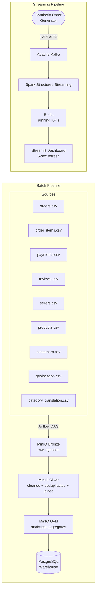

# OlistIQ

An end-to-end data engineering platform built on the real-world Brazilian Olist marketplace dataset — unifying fragmented e-commerce data spanning orders, payments, reviews, sellers, and logistics into a single queryable warehouse, with a real-time streaming layer surfacing live operational KPIs.

---

## What this does

The Olist dataset is a realistic mess: 9 separate CSV sources, no single foreign key chain connecting all of them, mixed granularities across orders, items, payments, and reviews. OlistIQ treats this as a production data problem — not a Kaggle exercise.

The platform has two layers:

**Batch layer** — a full Medallion Architecture (Bronze → Silver → Gold) on MinIO, using Spark for cleaning, deduplication, and cross-schema joins across all 9 sources, loading analytical aggregates into a PostgreSQL warehouse. Orchestrated end-to-end with Apache Airflow.

**Streaming layer** — a Kafka + Spark Structured Streaming pipeline ingesting synthetic live order events, pre-aggregating running KPIs into Redis, and surfacing them on a Streamlit operations dashboard with 5-second auto-refresh.

---

## Architecture

### Mermaid diagram



### ASCII diagram

```
 ┌─────────────────────────────────────────────────────────┐
 │  9 CSV Sources                                           │
 │  orders · items · payments · reviews · sellers ·        │
 │  products · customers · geolocation · categories        │
 └───────────────────────┬─────────────────────────────────┘
                         │  Airflow DAG
                         ▼
              ┌─────────────────────┐
              │  MinIO Bronze        │  raw ingestion, schema-on-read
              └──────────┬──────────┘
                         │
                         ▼
              ┌─────────────────────┐
              │  MinIO Silver        │  Spark cleaning, deduplication,
              │                      │  cross-schema joins
              └──────────┬──────────┘
                         │
                         ▼
              ┌─────────────────────┐
              │  MinIO Gold          │  analytical aggregates
              └──────────┬──────────┘
                         │
                         ▼
              ┌─────────────────────┐
              │  PostgreSQL          │  queryable warehouse
              │  Warehouse           │
              └─────────────────────┘


 ── Streaming layer (parallel) ──────────────────────────────

 ┌──────────────────┐
 │  Synthetic Order  │  live order events
 │  Generator        │
 └────────┬─────────┘
          │
          ▼
 ┌──────────────────┐
 │  Apache Kafka     │
 └────────┬─────────┘
          │
          ▼
 ┌──────────────────────────┐
 │  Spark Structured         │
 │  Streaming                │
 └────────┬─────────────────┘
          │
          ▼
 ┌──────────────────┐      ┌─────────────────────────────────┐
 │  Redis            │─────▶│  Streamlit Dashboard            │
 │  running KPIs     │      │  revenue · order status ·       │
 └──────────────────┘      │  payment breakdown · state map  │
                            └─────────────────────────────────┘
```

---

## Stack

| Layer | Technology | Role |
|---|---|---|
| Ingestion | CSV sources (9 files) + Kafka | Batch sources + synthetic streaming |
| Processing | Apache Spark | Cleaning, joining, aggregation |
| Stream processing | Spark Structured Streaming | Live KPI pre-aggregation |
| Data lake | MinIO (S3-compatible) | Bronze / Silver / Gold layers |
| KPI cache | Redis | Low-latency dashboard reads |
| Warehouse | PostgreSQL | Analytical query layer |
| Orchestration | Apache Airflow | Batch workflow scheduling |
| Dashboard | Streamlit | Live operational view |
| Infrastructure | Docker (16 services) | Full platform containerization |

---

## Key design decisions

**Why Medallion Architecture over a single-pass ETL?**
The Olist dataset has quality issues that only surface during joins — orders with no matching items, payments with no order reference, reviews with mismatched timestamps. Separating Bronze (raw), Silver (clean), and Gold (aggregated) layers makes each issue traceable and fixable without re-ingesting from source. It also mirrors how production data lakes are operated.

**Why Redis for streaming KPIs rather than querying PostgreSQL directly?**
The Streamlit dashboard refreshes every 5 seconds. Running analytical queries against PostgreSQL at that rate under concurrent load is wasteful. Spark Structured Streaming pre-aggregates running totals into Redis, so the dashboard reads a single key lookup rather than a full table scan.

**Why Airflow for batch orchestration?**
The 9-source join graph has real dependency ordering — geolocation must be available before customer enrichment, category translations before product joins. Airflow's DAG model makes these dependencies explicit and retryable, with full run history and alerting.

---

## Dataset

| Dimension | Value |
|---|---|
| Source | [Brazilian E-Commerce Public Dataset by Olist](https://www.kaggle.com/datasets/olistbr/brazilian-ecommerce) |
| CSV sources | 9 |
| Orders | ~100,000 |
| Time range | 2016–2018 |
| Geographies | Brazilian states (shown on live map) |

---

## Project structure

```
olistiq/
├── dags/               # Airflow DAGs (batch orchestration)
├── spark_jobs/         # Spark scripts (Bronze → Silver → Gold)
├── streaming/          # Kafka producer + Spark Streaming job
├── dashboard/          # Streamlit app
├── warehouse/          # PostgreSQL schema + seed scripts
├── docker/             # Docker Compose + service configs
└── notebooks/          # EDA and data profiling
```

---

## Running locally

**Prerequisites:** Docker, Docker Compose

```bash
git clone https://github.com/mahmoudnasser-97/olistiq
cd olistiq
docker compose up --build
```

Allow ~3–4 min for all 16 services to initialize. The Airflow scheduler will trigger the batch DAG automatically on first run.

| Service | URL |
|---|---|
| Streamlit dashboard | http://localhost:8501 |
| Airflow UI | http://localhost:8080 |
| MinIO console | http://localhost:9001 |

---

## Author

Mahmoud Nasser Elmoghany
[LinkedIn](https://linkedin.com/in/mahmoud-elmoghany) · [GitHub](https://github.com/mahmoudnasser-97)
